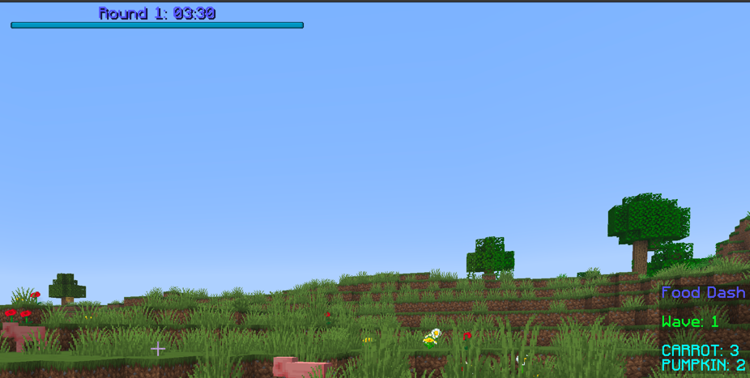

# Food Dash
### Objective
The objective of the game is to work with the other players to try to deliver
all the required food before the time runs out. The amount of food is 
increased with each wave.

### Building a Map For the Game
The game checks for items inserted into barrels. So you must make an area with
barrels that the players can use to deposit the food. My plan is to build the
map with the needed seeds/items to grow the food in chests as part of the world
save. Then a copy of the map will be made at server start up. There is currently
no system for designating chest locations and dynamically adding the necessary items
to grow the food. Maybe in the future.

### Feel Free to Contribute
I am making this minigame as a fun warmup into minigame development to prepare
for my work at Hypixel after a (small) break from Minecraft development. If you have
ideas, please fork this repo, and make a pull request.

### Screenshots
